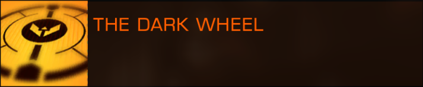

# Elite Codex summary

> From the _The Quest To Find Raxxla_ first page : 
<https://forums.frontier.co.uk/threads/the-quest-to-find-raxxla.168253/>

**Note**: The codex was introduced with the Beyond release **Oct/Nov 2018**.  

# RAXXLA

> "To the jewel that burns on the brow of the mother of galaxies! To the whisperer in witch-
space, the siren of the deepest void! The parent's grief, the lover's woe, and the yearning of
our vagabond hearts. To Raxxla!"

_Alleged toast of the Dark Wheel_

The legend of Raxxla has been circulation, in whispers, for centuries. The quest for this
mysterious place, the location of which is a deadly secret, was said to be the principal aim
of the Dark Wheel, a putative fraternity of legend-chasers from the early days of interstellar
travel.

The earliest recorded mention of Raxxla dates from 2296, from the journal of Art Tornqvist,
a shipboard mechanic based in the Tau Ceti systems. He writes: 'Cora comes home soused
and raving with wild stories, a new one every night. She claims she's found a map to some
pirate stash, and all I have to do is load her my ship so we can go dig it up. Meybe we
should go find Raxxla while we're at it!' Although Tornqvist's account is the first known
attestation of Raxxla, it is clear from text that the myth was already in circulation.

It is extremely difficult to find consistency among the various fragmentary rumours of
Raxxla. Much like the ancient myths of Atlantis, El Dorado and the kingdom of Prester John,
interpretations of the story range from the sceptical to the outlandish: Raxxla has been
suggested to be anything from an unremarkable moon to a state of cosmic enlightenment.
The earliest document stories tend to agree on several points, however: that Raxxla is a
definite place and that it holds a mystical secret.

Several versions of the Raxxla story mention an alien artefact, the Omphalos Rift, described
as a gateway or tunnel through which parallel universes can be accessed. These details
however, were later shown to bear a striking resemblance to children's story Princess
Astrophel and Spiralling Stars, and soon lost credibility. Undaunted, some Raxxla
seekers insisted that the story's author had cunningly concealed facts about the
mysterious locale in his book as hints for those with eyes to see.

Students of Raxxla lore have noted that the legend exerts a strangely potent fascination on
the minds of seekers. Commentators have compared this sensation to 'fernweh'. the
unaccountable longing for a place one has never seen. More than one interstellar
treasure-seeker has become obsessed with Raxxla to the exclusion of all other dreams,
and spent his or her entire life in a futile search for it.

Raxxla also plays a role in several conspiracy theories, most of which attest that it has
already been discovered by some kind of sinister cabal (or sole tyrant), which has
leveraged its power to establish covert dominance over humanity.

Whatever the truth of the matter, one thing remains irrefutable: the legend of Raxxla
continues to inspire explorers and conspiracy theorists to this day.

# THE DARK WHEEL

> "Oh, they're out there alright. I've never met them, but I know they're oout there. Think about
how well known the stories are. Now think about how easy it would be for some two-bit
band of hucksters to pass themselves off as the Dark Wheel and start trading on their
reputation. Doesn't happen, does it? Not for long, anyway. Whenever someone tries to
usurp the Dark Wheel name, sooner or later they get quietly shut down. And that's how I
know"

_Felicy Farseer, explorer_

The Dark Wheel is the name given to a legendary group of adventurers, explorers,
investigators and treasure-hunters, the existence of which is so lacking in corroborative
evidence that it is generally considered a myth. The group is often mentioned in
connection with the equally unsubstantiated 'Raxxla'.

Those who believe in the existence of the Dark Wheel consider it to be a continuous and
clandestine organisation operating since the very earliest days of interstellar travel.
According to the lore, only a handful of the bravest and most competent pilots of each
generation are honoured with an invitation to join the group. It is futile to attempt to
contact the Dark Wheel on one's own initiative, however - it is always they who initiate
contact, initially in disguise, revealing their true identity only once a suitable test of
courage and skill has been discreetly administered, and passed.

Opposing theories assert that new members are selected on the basis of lineage, with
existing members covertly training their children and revealing the fact of their
membership only when the child is ready. Conversely, some members are believed to go to
great lengths to prevent their children from ever become involved, the the group's
secrets are dangerous.

According to self-professed Dark Wheel expert Lyta Crane, a conspiracy theorist and
'people's journalist' who has painstakingly assembled an archive of relevant data, the
original group was based in a disused starport orbiting the eighth moon of an unnamed
gas giant. The station was toroid, hence 'wheel', and operated with a minimal power output
so as to avoid detection, hence 'dark'.

Crane believes that this starport is still in use, and is the only means whereby the genuine
Dark Wheel can verify its identity; new inductees can examine the record and artefacts
preserved there, and thus satisfy themselves that the group has indeed been operating for
centuries. No such starport has ever been found, however, and rival experts have accused
Crane of forging her evidense in order to maintain the revenue from her billions of
followers.

Over the years, many people have claimed to be members of the Dark Wheel, to have
identified some or all of the group's members, or to have discovered the group's location,
but the contradictory nature of these claims suggests that most of them, if not all, are
untrue.

In 3300, a group identifying itself as the Dark Wheel emerged in the Shinrarta Dezhra
system, which is not accessible to pilots of lower than Elite rank. It is not apparent if the
group is a legitimate descendant of the original Dark Wheel, a reconstruction, or merely an
opportunistic imitator.

